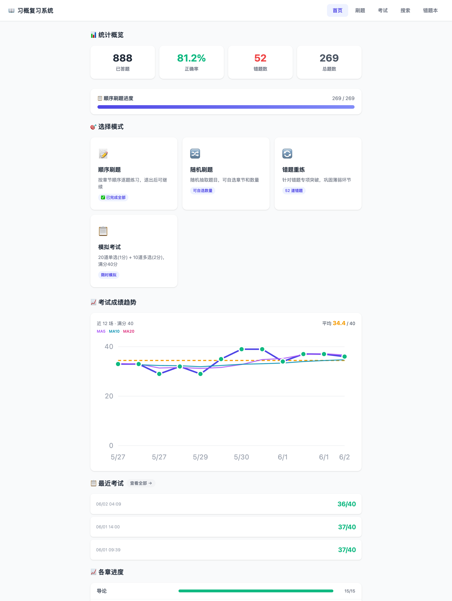
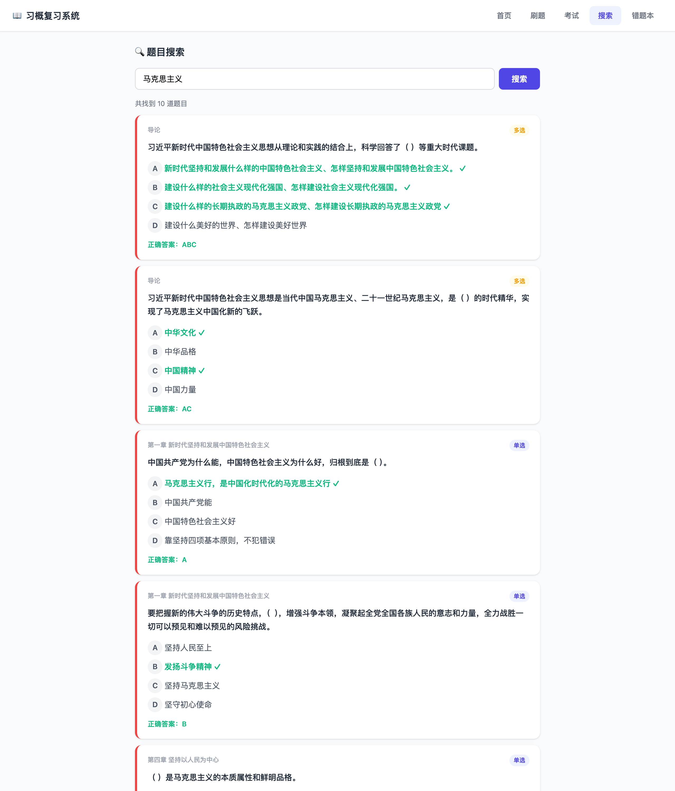
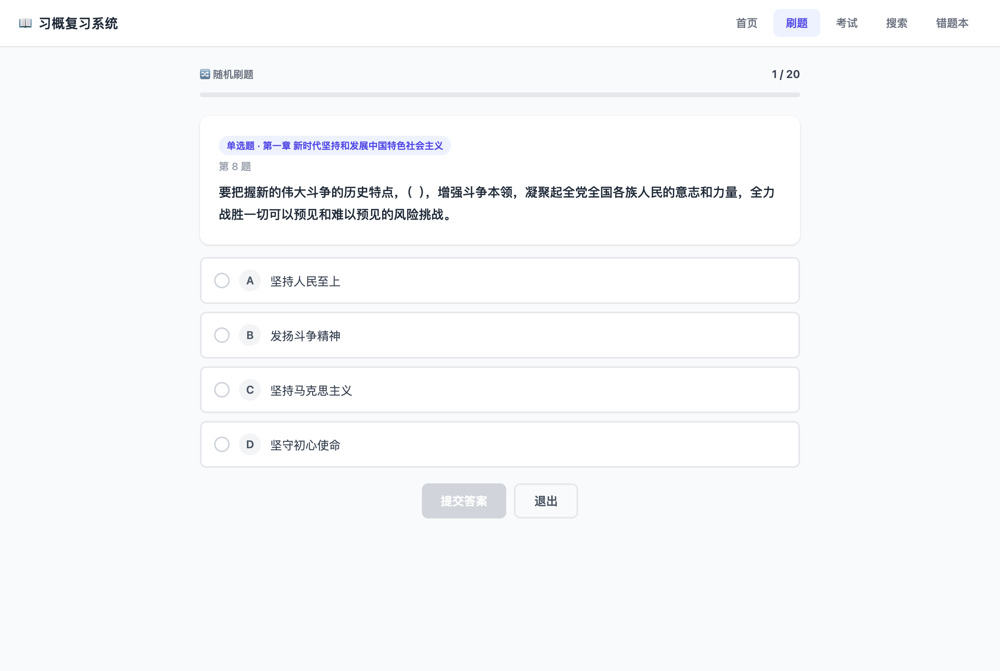

<div align="center">

# 📖 习概选择题复习系统

**福州大学《习近平新时代中国特色社会主义思想概论》选择题刷题与复习系统**

开箱即用 · 离线本地运行 · 顺序刷题 / 随机练习 / 错题本 / 模拟考试 / 题目搜索

[](LICENSE)
[](https://www.python.org/)
[](https://fastapi.tiangolo.com/)
[](https://www.sqlite.org/)
[](#-贡献)
[](https://github.com/muxia23/xigai-quiz/stargazers)



</div>

---

## ✨ 功能特性

| 模块 | 说明 |
| --- | --- |
| 📝 **顺序刷题** | 按章节顺序逐题练习，自动记录进度，退出后可断点续刷 |
| 🔀 **随机刷题** | 随机抽取题目，可自选章节与题量（10 / 20 / 30 / 50 / 100 / 全部） |
| 🔄 **错题重练** | 答错自动进错题本，连续答对 4 次自动毕业；支持一键导出 PDF |
| 📋 **模拟考试** | 20 道单选（1 分）+ 10 道多选（2 分），满分 40 分，自动判分 |
| 🔍 **题目搜索** | 按题干 / 选项 / 章节关键词模糊检索，结果直接标注正确答案 |
| 📈 **数据统计** | 答题量、正确率、各章掌握度，以及考试成绩趋势（含 5/10/20 移动平均线） |

题库共 **269 题**（177 道单选 + 92 道多选），覆盖全部章节，数据源为 [`26年上学期选择题汇总.json`](26年上学期选择题汇总.json)。

## 📸 界面预览

| 题目搜索 | 刷题练习 |
| :---: | :---: |
|  |  |

## 🛠️ 技术栈

- **后端**：[FastAPI](https://fastapi.tiangolo.com/) + [Uvicorn](https://www.uvicorn.org/)
- **数据库**：SQLite（标准库 `sqlite3`，WAL 模式）
- **前端**：原生 HTML / CSS / JavaScript，单文件、零构建、无框架
- **PDF 导出**：[WeasyPrint](https://weasyprint.org/)

> 整个项目无前端构建步骤、无 Node 依赖，克隆即可运行。

## 🚀 快速开始

### 环境要求

- Python 3.10 及以上

### 一键启动

```bash
git clone https://github.com/muxia23/xigai-quiz.git
cd xigai-quiz
./run.sh
```

首次运行会自动创建虚拟环境 `.venv` 并安装依赖（FastAPI / Uvicorn / WeasyPrint），随后从题库 JSON 初始化一个**空答题记录**的数据库。

启动后浏览器访问 👉 **<http://127.0.0.1:8000>**

### 手动启动（可选）

```bash
python -m venv .venv && source .venv/bin/activate
pip install -r requirements.txt
python main.py
```

## 📂 项目结构

```
xigai-quiz/
├── main.py                    # FastAPI 后端：题目 / 答题 / 错题 / 考试 / 搜索 接口
├── database.py                # SQLite 建表与题库初始化
├── static/
│   └── index.html             # 单文件前端（含全部页面与交互逻辑）
├── 26年上学期选择题汇总.json   # 题库数据源
├── test_exam_dedup.py         # 模拟考试去重逻辑测试
├── requirements.txt
└── run.sh                     # 一键启动脚本
```

## 🔌 API 一览

| 方法 | 路径 | 说明 |
| --- | --- | --- |
| `GET` | `/api/questions` | 获取题目（`mode`=fixed/random/wrong，可按 `chapter` 过滤） |
| `GET` | `/api/search` | 题目搜索（`q` 关键词） |
| `POST` | `/api/record` | 提交单题作答 |
| `GET` | `/api/stats` | 统计概览与各章进度 |
| `POST` | `/api/exam/start` | 生成一份模拟试卷 |
| `POST` | `/api/exam/submit/{id}` | 提交试卷并判分 |
| `GET` | `/api/exam/history` | 考试历史记录 |
| `GET` | `/api/wrong/pdf` | 导出错题 PDF |

## 🗄️ 数据与隐私

- 运行时数据库 `quiz.db` 保存在**本地**，仅含你个人的答题历史，**已被 `.gitignore` 排除，不会进入版本库**。
- 程序在 `quiz.db` 不存在或题目为空时，会自动从题库 JSON 重新初始化，**不会覆盖**已有答题记录。
- 整个应用离线运行，不联网、不上传任何数据。

## ❓ 常见问题

<details>
<summary><b>题库内容来自哪里？能用于其他课程吗？</b></summary>

题库为福州大学《习概》课程选择题整理，仅供学习复习参考。更换 `26年上学期选择题汇总.json`（保持相同结构）即可适配其他题库。
</details>

<details>
<summary><b>导出 PDF 报错 / 失败？</b></summary>

PDF 功能依赖 WeasyPrint，其底层需要 Pango 等系统库。macOS 可用 `brew install pango`，Linux 参考 [WeasyPrint 安装文档](https://doc.courtbouillon.org/weasyprint/stable/first_steps.html)。
</details>

<details>
<summary><b>如何重置我的刷题记录？</b></summary>

在「错题本」页底部点击「重置所有记录」即可清空答题、错题与考试数据（题库不受影响）。
</details>

## 🤝 贡献

欢迎提交 Issue 与 Pull Request！

1. Fork 本仓库并新建分支
2. 提交你的改动（题库勘误、功能优化、Bug 修复等均可）
3. 发起 Pull Request

## 📄 许可证

本项目基于 [MIT License](LICENSE) 开源。题库内容版权归原作者所有，仅供学习交流使用。
